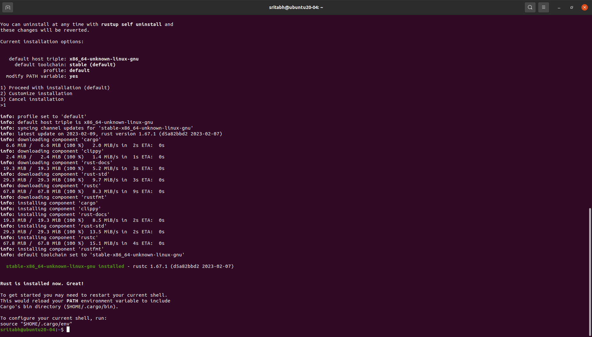
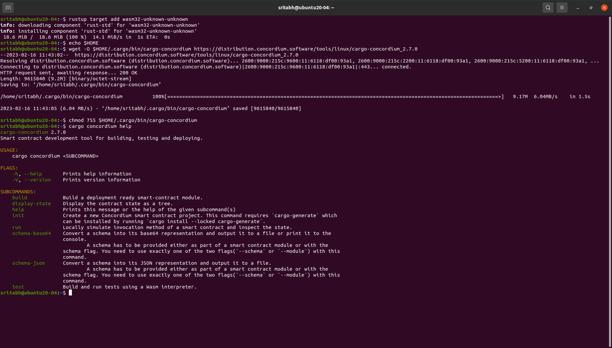
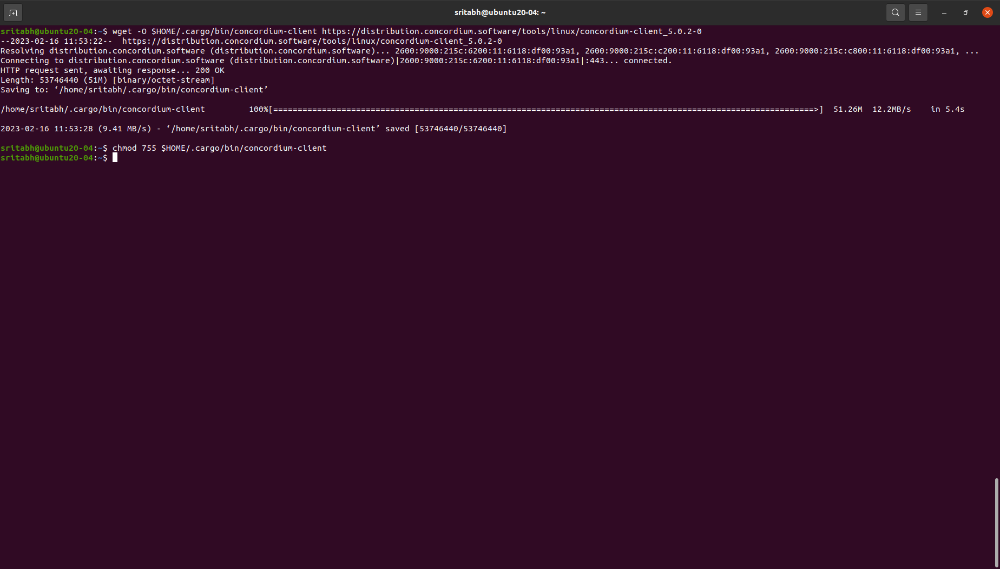
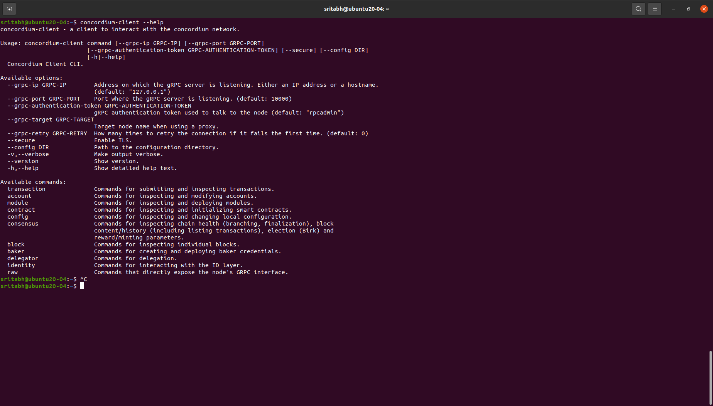
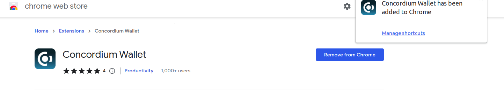
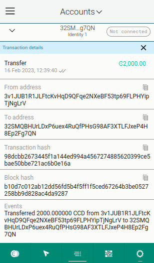
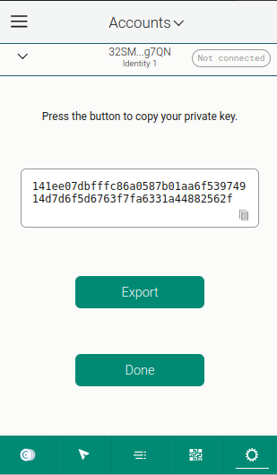
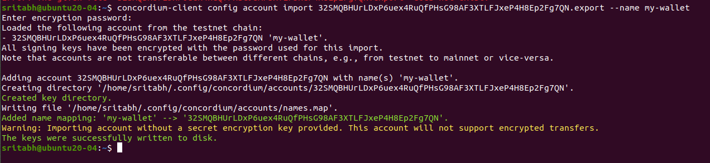

# Concordium Hackathon- Task 1

## Payout Info

0x1938b58567a139F62953fF6aBADc2dA67319640a

CCD Mannet - 

## Installing RUST and Cargo
```
curl --proto '=https' --tlsv1.2 -sSf https://sh.rustup.rs | sh
```


### Installing WASM

```
rustup target add wasm32-unknown-unknown
```

### Installing cargo-concordium
```
wget -O $HOME/.cargo/bin/cargo-concordium https://distribution.concordium.software/tools/linux/cargo-concordium_2.7.0
```
> Give executable permission to the file
```
chmod 755 $HOME/.cargo/bin/cargo-concordium
```
> Check if the installation is successful
```
cargo concordium --help
```



### Installing Concordium Client
```
wget -O $HOME/.cargo/bin/concordium-client https://distribution.concordium.software/tools/linux/concordium-client_5.0.2-0
```

> Give executable permission to the file
```
chmod 755 $HOME/.cargo/bin/concordium-client
```


> Check if the installation is successful
```
concordium-client --help
```



### Web Wallet Installation
[Extention here](https://chrome.google.com/webstore/detail/concordium-wallet/mnnkpffndmickbiakofclnpoiajlegmg?hl=en-US)



### Claiming 2000 CCD


### Exporting Private Key


### Export Account from Web Wallet
```
concordium-client config account import 32SMQBHUrLDxP6uex4RuQfPHsG98AF3XTLFJxeP4H8Ep2Fg7QN.export --name my-wallet
```
